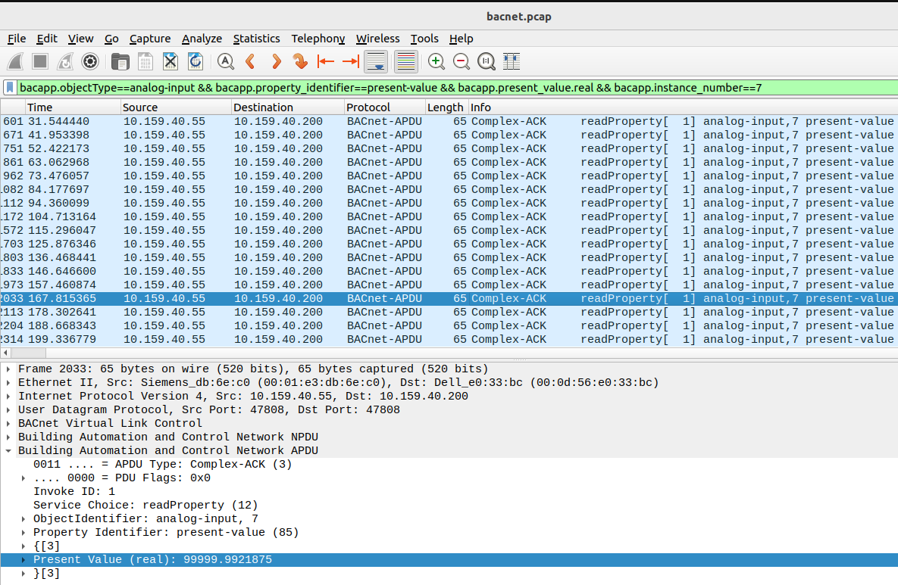
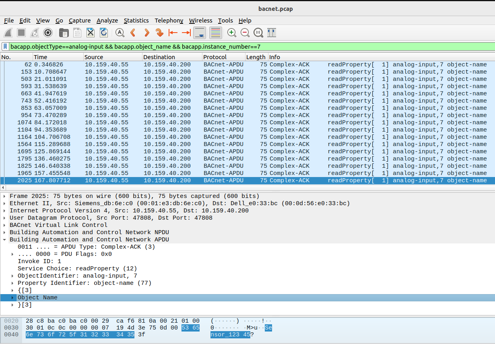

## Pain in the BAC(net)

BACnet Stands for Building Automation and Control Networks. BACnet was formed by ASHRAE in 1995 as Standard 135.  
Learn more:  [BACnet tutorial](https://blog.smartbuildingsacademy.com/whatisbacnet)

### Challenge

Attached is a packet capture taken from a building management network. One of the analog sensors reported values way outside of its normal operating range. Can you determine the object name of this analog sensor? 

Flag Format: flag{Name-of-sensor}. 
For example if the object name of this analog sensor was "Sensor_Temp1", the flag would be flag{Sensor_Temp1}. (Note: because there are a limited number of sensors, we're only giving you two guesses for this challenge, so please check your input carefully.) 

Author: CISA

File:  bacnet.pcap

### References:

[https://github.com/infosecstreams/csaw21/tree/gh-pages/a-pain-in-the-bacnet](https://github.com/infosecstreams/csaw21/tree/gh-pages/a-pain-in-the-bacnet) [PDF](APainInTheBACnet.pdf)

[Display Filter Reference: Building Automation and Control Network APDU](https://www.wireshark.org/docs/dfref/b/bacapp.html)

### present-value



The present-value contains the real values of sensor readings.  Sensors should report readings within an acceptable range.  In the query below, instance number 7 has some sensor readings between 1400 - 1500, but a few readings are slightly above 99999.  The sensor name for the sensor reporting these high readings is most likely the flag.

```
$ tshark -T fields -e bacapp.present_value.real -e bacapp.instance_number -r bacnet.pcap 'bacapp.objectType==analog-input && bacapp.property_identifier==present-value && bacapp.present_value.real && bacapp.instance_number==7' | sort -n

1405.66235351562	7
1411.18664550781	7
1418.33959960938	7
1420.12353515625	7
1431.7744140625	  7
1432.81823730469	7
1436.71887207031	7
1446.45324707031	7
1452.45703125	    7
1467.9677734375	  7
1470.427734375	  7
1477.85900878906	7
1478.26916503906	7
1483.56103515625	7
1491.82995605469	7
1493.13427734375	7
99999.9921875	7
99999.9921875	7
99999.9921875	7
99999.9921875	7

```
The following queries show some helpful commands.  Sorting tshark output can be useful.  
sort -n sorts the output by the first field or ``` bacapp.present_value.real ``` in this query.  sort -nr sorts in reverse order.
```
tshark -T fields -e bacapp.present_value.real -e bacapp.instance_number -r bacnet.pcap 'bacapp.objectType==analog-input && bacapp.property_identifier==present-value && bacapp.present_value.real' | sort -n

tshark -T fields -e bacapp.present_value.real -e bacapp.instance_number -r bacnet.pcap 'bacapp.objectType==analog-input && bacapp.property_identifier==present-value && bacapp.present_value.real' | sort -nr
```
This query reveals the present-value in all the analog-input object types:
```
tshark -T fields -e bacapp.present_value.real -r bacnet.pcap 'bacapp.objectType==analog-input && bacapp.property_identifier==present-value && bacapp.present_value.real'
```
In order to get the name of the sensor reporting the high values slightly above 99999, get the object_name.

### object_name



```
tshark -T fields -e bacapp.instance_number -e frame.number -e bacapp.object_name -r bacnet.pcap 'bacapp.objectType==analog-input && bacapp.object_name && bacapp.instance_number==7'
7	62	Sensor_12345
7	153	Sensor_12345
7	503	Sensor_12345
7	593	Sensor_12345
7	663	Sensor_12345
7	743	Sensor_12345
7	853	Sensor_12345
7	954	Sensor_12345
7	1074	Sensor_12345
7	1104	Sensor_12345
7	1164	Sensor_12345
7	1564	Sensor_12345
7	1695	Sensor_12345
7	1795	Sensor_12345
7	1825	Sensor_12345
7	1965	Sensor_12345
7	2025	Sensor_12345
7	2105	Sensor_12345
7	2196	Sensor_12345
7	2306	Sensor_12345
```

flag{Sensor_12345}


